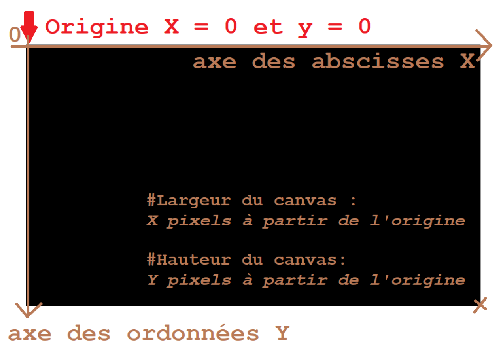
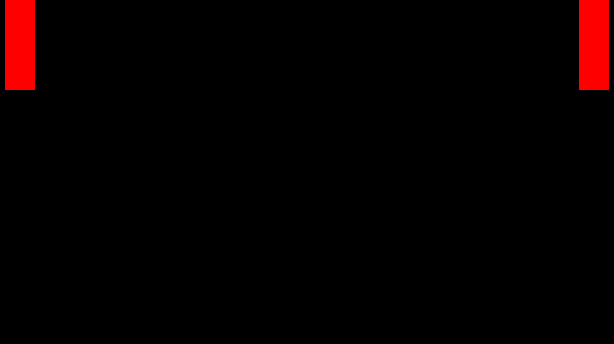
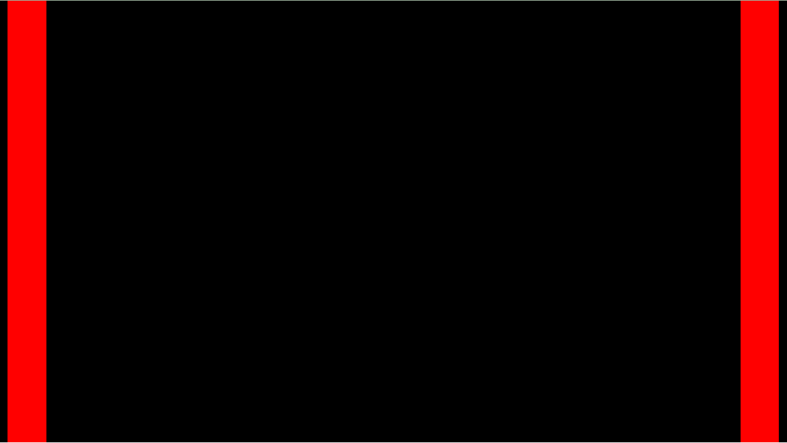

== JsFighter II ! L'ultime tutoriel !
=== Création des fichiers de base.
Mise en place de la structure HTML de base :

[source,html]
----
<!DOCTYPE html>
<html lang="fr">
<head>
    <meta charset="UTF-8">
    <meta http-equiv="X-UA-Compatible" content="IE=edge">
    <meta name="viewport" content="width=device-width, initial-scale=1.0">
    <title>Street Fighter</title>
    <link  rel="stylesheet" href="../style.css" />
</head>
<body>
    <canvas id="screenGame"></canvas>

    
</body>
</html>

----

Fichier `style.css`

[source, css]
----
* {
    margin:0;
    padding:0;
    box-sizing: border-box;
}

body {
    overflow: hidden;
    background-color: white;
}

#screenGame {
    position: absolute;
    top:0;
    left:0;
}
----

[CAUTION]
====
N'oubliez pas de créer un fichier `script.js` qui contiendra nos premières lignes de code.
====

:sectnums:
=== Mise en place du background

Il faut définir un premier espace dans lequel seront dessinés nos premiers personnages ! (_Des rectangles pour commencer !_).

Pour cela il faut sélectionner notre `canvas` et lui donner la dimension que nous souhaitons. Nous travaillerons dans un rectangle de dimension *1024*576*.

[source, javascript]
----
const canvas = document.querySelector('canvas')
canvas.width = 1024;
canvas.height = 576;
----

La méthode `getContext` de l'objet `canvas` va nous permettre de manipuler un objet de contexte contenant des outils de dessin dans un espace en 2D ou 3D.
Nous souhaitons utiliser les outils pour de la 2D.

[source, javascript]
----
const c = canvas.getContext('2d');
----

Maintenant, nous disposons d'un outil pour dessiner un rectangle qui sera le `background` de notre espace de jeu.

Pour dessiner, nous utiliserons la méthode `fillRect` pour dessiner un rectangle. Les 4 arguments de cette méthode sont les coordonnées du point de départ du tracé ainsi que les coordonnées de fin de tracé.

Sachant que l'origine du canvas (le point de coordonnées _{0,0}_ ) se situe au coin supérieur gauche, nous pouvons déduire facilement les coordonnées de fin du tracé, qui correspondent à la largeur et la hauteur de notre canvas soit _{1024, 576}_.

Dessinons donc notre background : 

[source, javascript]
----
c.fillRect(0, 0, canvas.width, canvas.height);
----

=== Création des deux joueurs.

Nous distinguerons le joueur de gauche, qui sera appelé `Player` et le joueur de droite, qui sera appelé `Enemy`.

Nous pouvons continuer à utiliser l'outil `c.fillRect` pour dessiner nos protagonistes ! Mais le but est de créer un jeu où chacun va interagir avec l'autre ! Nous allons avoir donc deux entités distinctes avec leurs propres paramètres.
C'est pourquoi dès maintenant nous allons concevoir les choses avec les classes d'objets.

Dans le domaine des jeux vidéos en 2 dimensions, les objets qui peuvent se mouvoir indépendamment du fond(ou décor ou background ) sont appelés des *sprites*.

Créons donc une classe nommée `Sprite`.

Nous faisons le choix d'utiliser le type `object` pour définir la position du sprite plutôt que de deux `integer` séparés pour éviter d'avoir d'un constructeur comportant un très grand nombre d'arguments.

[source, javascript]
----
class Sprite {
    constructor(position) {
        this.position = position
    }
}
----

Il faut maintenant créer un `player` qui soit une instance de la classe `Sprite`.

[source, javascript]
----
const player = new Sprite({
    x:10,
    y:0
})
----

Maintenant que `player` est instancié, nous pouvons ajouter de nouvelles méthodes à la classe `Sprite`.

La méthode `draw` va permettre de dessiner un rectangle représentant notre joueur dans le `canvas`.

[source, javascript]
----
class Sprite {

    // ........

    draw() {
        c.fillStyle = 'red';
        c.fillRect(this.position.x, this.position.y, 50,150);
    }
}
----

Nous pouvons tester le résultat en instanciant un objet `Sprite` et en appelant la méthode `draw()`

[source, javascript]
----
const player = new Sprite({x:10,y:0})
player.draw();
----

Pour créer un ennemi, il suffit de dupliquer le code du joueur et modifier sa position.

[source, javascript]
----
const enemy = new Sprite({x:964,y:0})
enemy.draw();
----
Vous devriez avoir ce rendu actuellement :

=== Boucle d'animation

Avant de commencer à vouloir coder les animations de nos personnages, il va falloir mettre en place une boucle d'animation.

Nous utiliserons la méthode `requestAnimationFrame` de l'objet `window` qui  indique au navigateur qu'on souhaite exécuter une animation et demande que celui-ci exécute une fonction spécifique de mise à jour de l'animation, avant le prochain rafraîchissement à l'écran du navigateur. Cette méthode prend comme argument une fonction de rappel qui sera appelée avant le rafraîchissement du navigateur.

Si vous souhaitez animer une nouvelle frame durant le prochain affichage, la fonction de rappel doit de nouveau appeler la méthode `requestAnimationFrame()`. Autrement dit, `requestAnimationFrame()` ne fonctionne qu'une fois.

C'est pour cette raison qu'il faudra créer une fonction qui contiendra un appel à  `requestAnimationFrame()` et qui lui sera passé en argument de manière recursive.

[source, javascript]
----
function animate() {
    window.requestAnimationFrame(animate);
}
animate();
----

=== Velocity

Les deux personnages vont être animés afin d'arriver au niveau du sol. 
Il faut intégrer une nouvelle valeur à notre `Sprite` qui est la vélocité, sa vitesse de déplacement sur l'axe des abscisses et des ordonnées.

Pour cela ajoutons tout simplement au constructeur de la classe `Sprite` ce nouveau paramètre. 

[source, javascript]
----
class Sprite {
    constructor(position, velocity) {
        this.position = position;
        this.velocity = velocity;
    }
}
----

`velocity` est le deuxième argument du constructeur. Nous risquons d'en avoir beaucoup d'autres à l'avenir et il faudra retenir leur position dans le constructeur au risque de générer des erreurs ou des comportements inattendu dans notre programme !

Une solution serait de modifier notre constructeur afin qu'il ne prenne qu'un seul objet en argument, qui contiendrait l'ensemble de nos paramètres de configuration du `Sprite`. Ainsi, peu importe l'ordre de saisie, puisque les paramètres seraient ensuite utilisés par le constructeur, non pas par leur position en tant qu'argument, mais par leur nom de clé au sein d'un objet unique les regroupant.

[source, javascript]
----
class Sprite {
    constructor( { position, velocity } ) {
        this.position = position;
        this.velocity = velocity;
    }
    // .......
}
----

Par conséquent, nous devons modifier le code instanciant les objets `player` et `enemy`.

[source, javascript]
----
const player = new Sprite({
    position : {x:10,y:0},
    velocity: {x:0,y:0}

})
player.draw();

const enemy = new Sprite({
    position : {x:964,y:0},
    velocity: {x:0,y:0}
})
enemy.draw();
----

=== Méthode `Update()`

Nos `Sprite` vont changer de position sur les deux axes.
Nous avons vu que le navigateur met à jour les *frames* d'animations grâce à la méthode `animate()` que nous avons créée.

Il faut donc créer dans la classe `Sprite` une méthode `Update` qui sera chargée de changer les coordonnées de notre objet à chaque *frame*.

[source, javascript]
----
class Sprite {
    // .......
    draw() {
        c.fillStyle = 'red';
        c.fillRect(this.position.x, this.position.y, 50,150);
    }
    update() {
        this.draw();
        this.position.y += 10;
    }
    // .......
}
----

Maintenant, il faut intégrer l'appel de la méthode `update()` dans la boucle d'animation `animate`. Nous n'avons plus besoin d'appeler les méthodes `draw()` comme vu précédemment.

[source, javascript]
----
// ..........

function animate() {
    window.requestAnimationFrame(animate);
    player.update();
    enemy.update();
}
animate();
----

Lorsque nous testons notre mise à jour, nous avons la surprise de voir notre animation s'afficher de façon inattendu...

Mais cela est tout à fait normal !!
Nos objets avaient une première position où un dessin d'un rectangle rouge a été tracé !
Puis, une deuxième position, avec le tracé d'un nouveau rectangle ! Sans effacer le précédent... Car nous ne l'avons pas demandé.

De plus, à chaque rafraichissement des frames, nos objets sont continuellement mis à jour avec une nouvelle position en coordonnée Y... même si nous dépassons du cadre du canvas.

Dans un premier temps, il faudra donc nettoyer toute la zone du canvas que l'on désire, et cela, à chaque nouvelle frame et avant la mise à jour des nouvelles positions des objets.

Nous utiliserons la méthode `clearRect` du contexte.

[source, javascript]
----
// ..........

function animate() {
    window.requestAnimationFrame(animate);
    c.clearRect(0, 0, canvas.width, canvas.height);
    player.update();
    enemy.update();
}
animate();
----

